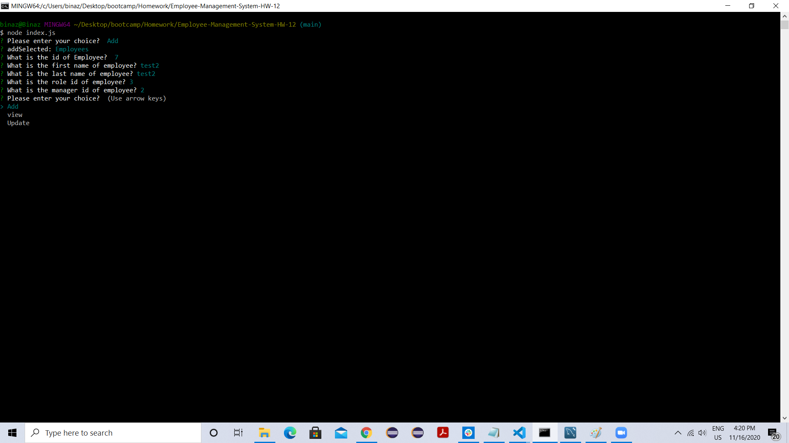
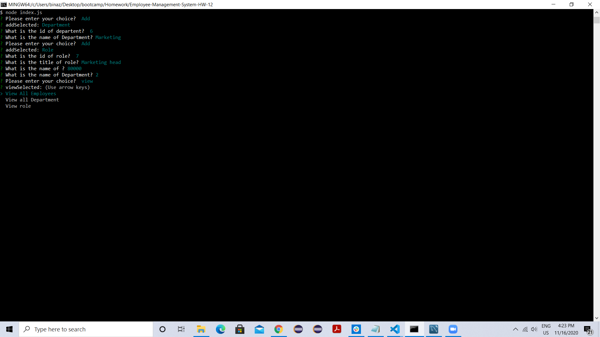

# Employee-Management-System-HM-12
This is a command line application for employee management. This application allows user to add employees, department and roles as per their requirement. It also allows user to view all entries by employees, department and role. Finally it allows user  to update manager Id and role Id for employees and update role title and role salary.
It uses mysql database to interact with database.

# Images

# Links
Github link: https://github.com/karimkapadia/Employee-Management-System-HW-12

Video Link: https://drive.google.com/file/d/1nK0uH3j5dGHkmsDHKDPEanWEmooPYrXH/view

